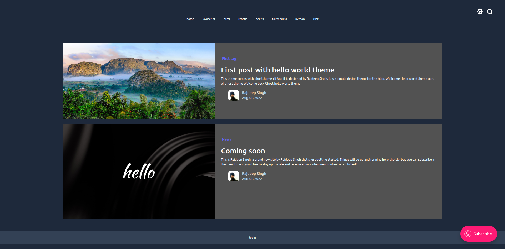

Install the `hello-world` theme in your ghost cms. It is a basis structure for ghost theme.

You install this theme with npm or yarn command line. it is provide helping to build the ghost theme. 
[ghosttheme-cli](https://www.npmjs.com/package/ghosttheme-cli)

```
git clone https://github.com/officialrajdeepsingh/hello-world.git

cd hello-world

npm start // sprate server for tailwindcss

```
